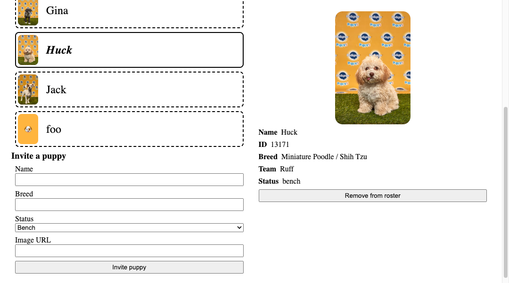

# Puppy Bowl

Welcome to the annual [Puppy Bowl](https://fsa-puppy-bowl.herokuapp.com/api/)! Teams of puppies will compete in a variety of events, including fetching sticks, wagging tails, and looking adorable! You've been contracted to build a web application that will let administrators manage the players participating in the Puppy Bowl.

Read the [API documentation](https://fsa-puppy-bowl.herokuapp.com/api/) before starting.

> [!WARNING]
>
> Set the `COHORT` code in `index.js` to your cohort + your name (e.g. `2506-JOHN`).
> You don't want your classmates to delete your data while you're working, and vice versa!

## Requirements

You'll be building this project from scratch! You are highly encouraged to reference previous solutions. Your submission should fulfill the following requirements.

### Show roster of puppies

When your app loads, users should see a list of all players available on the API, regardless of team affiliation.

Each player in the roster is displayed with at least the following information:

- name
- image (with alt text of the player's name)

When the player in the roster is clicked, the app should display more information about the selected player as described below.

### Display more information about the selected puppy

This section of the app should be displayed separately from the list of players.

If a player has not yet been selected, a message should be displayed encouraging the user to select a player.

When a player in the roster is clicked, this section should display at least the following information about the selected player:

- name
- id
- breed
- status
- image (with alt text of the player's name)
- team name, if the player has one, or "Unassigned"

#### Remove the selected puppy from the roster

Additionally, there should be a "Remove from roster" button, that when clicked, will request to remove the selected player via the API.

Once the player is removed,

- The roster of all puppies should automatically update to reflect the removed puppy.
- This details section should also be updated to indicate that there is no longer a selected player.

### Add a puppy to the roster

Your app should also include a form to add a puppy to the roster. Users should be able to provide at least the following information:

- name
- breed

When the form is submitted, the roster of all puppies should automatically update to reflect the newly added player.

## Submission

For this career simulation, you will have to **make a pull request** from your fork into the main branch of the starter repo. The title of your pull request should include your full name. Submit the link to your _pull request_.
